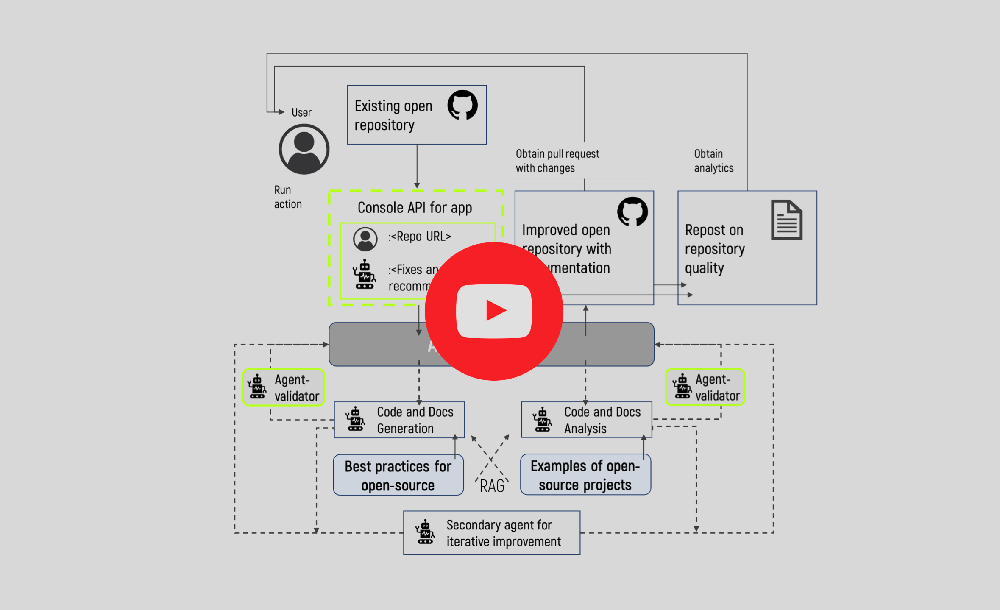

# OSA: OPEN-SOURCE ADVISOR

---

## Overview

OSA (Open-Source-Advisor) is a LLM-based tool for improving the quality of scientific open source projects and helping
create them from scratch.
It automates the generation of README, different levels of documentation, CI/CD scripts, etc.
It also generates advices and recommendations for the repository.

OSA is currently under development, so not all features are implemented.

---

## How it works?

Here is a short video:

[](https://www.youtube.com/watch?v=LDSb7JJgKoY)

---

## Table of contents

- [Core features](#core-features)
- [Installation](#installation)
- [Getting started](#getting-started)
- [Examples](#examples)
- [Documentation](#documentation)
- [Contributing](#contributing)
- [License](#license)
- [Acknowledgments](#acknowledgments)
- [Citation](#citation)

---

## Core features

1. **README file generation**: Automates the creation of a clear and structured README file for a repository, including
   projects based on research papers.

2. **Documentation generation**: Automatically generates docstrings for Python code.

3. **Automatic implementation of changes**: Clones the repository, creates a branch, commits and pushes changes, and
   creates a pull request with proposed changes.

4. **Various LLMs**: Use OSA with an LLM accessible via API (e.g., OpenAI, VseGPT, Ollama), a local server, or try
   an [osa_bot](https://github.com/osa-bot) hosted on ITMO servers.

---

## Installation

Install Open-Source-Advisor using one of the following methods:

**Using PyPi:**

```sh
pip install osa_tool
```

**Build from source:**

1. Clone the Open-Source-Advisor repository:

```sh
git clone https://github.com/aimclub/OSA
```

1. Navigate to the project directory:

```sh
cd Open-Source-Advisor
```

1. Install the project dependencies:

**Using `pip`** &nbsp;
[](https://pypi.org/project/pip/)

```sh
pip install -r requirements.txt
```

**Using `poetry`** &nbsp;
[](https://python-poetry.org/)

```sh
poetry install 
```

**Using `docker`** &nbsp;
[](https://www.docker.com/)

```sh
docker build --build-arg GIT_USER_NAME="your-user-name" --build-arg GIT_USER_EMAIL="your-user-email" -f docker/Dockerfile -t {image-name} .
```

---

## Getting started

### Prerequisites

OSA requires Python 3.11 or higher.

File `.env` is required to specify GitHub/GitLab/Gitverse token (GIT_TOKEN) and LLM API key (OPENAI_API_KEY or
AUTHORIZATION_KEY)

When running `osa-tool` from CLI, you need to set the GIT_TOKEN and API key first:

```sh
# Linux / macOS (bash/zsh)
export OPENAI_API_KEY=<your_api_key>
export GIT_TOKEN=<your_git_token>

# Windows (PowerShell)
setx OPENAI_API_KEY "<your_api_key>"
setx GIT_TOKEN "<your_git_token>"
```

### Tokens

| Token name          | Description                                                                                                                                                                          | Mandatory |
|---------------------|--------------------------------------------------------------------------------------------------------------------------------------------------------------------------------------|-----------|
| `GIT_TOKEN`         | Personal GitHub/GitLab/Gitverse token used to clone private repositories, access metadata, and interact with its API.                                                                | Yes       |
| `OPENAI_API_KEY`    | API key for accessing [OpenAI](https://platform.openai.com/docs/api-reference/introduction), [vsegpt](https://vsegpt.ru/Docs/API) and [openrouter](https://openrouter.ai/) providers | No        |
| `AUTHORIZATION_KEY` | API key for [gigachat](https://developers.sber.ru/portal/products/gigachat-api) provider                                                                                             | No        |
| `X-API-Key`         | API key for the [pepy.tech](https://pepy.tech/pepy-api) REST API, used to fetch Python package download statistics                                                                   | No        |

### Usage

Run Open-Source-Advisor using the following command:

**Using `pip`** &nbsp;
[](https://pypi.org/project/pip/)

```sh
python -m OSA.osa_tool.run -r {repository} [--api {api}] [--base-url {base_url}] [--model {model_name}] [--attachment {article}]
```

**Using `docker`** &nbsp;
[](https://www.docker.com/)

```sh
docker run --env-file .env {image-name} -r {repository} [--api {api}] [--base-url {base_url}] [--model {model_name}] [--attachment {article}]
```

The --attachment option enables you to choose a README template for a repository based on an article. You can provide
either a link to a PDF file of the article or a path to a local PDF file after the --attachment option. If you are using
Docker, ensure that you upload the PDF file to the OSA folder before building the image, then, specify the path as
/app/OSA/... or just use volume mounting to access the file.

The --generate-workflows option is intended to create customizable CI/CD pipelines for Python repositories. For detailed
documentation, see the [GitHub Action Workflow Generator README](workflow-generator/index.md).

### Configuration

| Flag                 | Description                                                                         | Default                     |
|----------------------|-------------------------------------------------------------------------------------|-----------------------------|
| `-r`, `--repository` | URL of the GitHub/GitLab/Gitverse repository (**Mandatory**)                        |                             |
| `-b`, `--branch`     | Branch name of the repository                                                       | Default branch              |
| `-o`, `--output`     | Path to the output directory                                                        | Current working directory   |
| `--api`              | LLM API service provider                                                            | `itmo`                      |
| `--base-url`         | URL of the provider compatible with API OpenAI                                      | `https://api.openai.com/v1` |
| `--model`            | Specific LLM model to use                                                           | `gpt-3.5-turbo`             |
| `--top_p`            | Nucleus sampling probability                                                        | `0.95`                      |
| `--temperature`      | Sampling temperature to use for the LLM output (0 = deterministic, 1 = creative).   | `0.05`                      |
| `--max_tokens`       | Maximum number of output tokens the model can generate in a single response         | `4096`                      |
| `--context_window`   | Total number of model context (Input + Output)                                      | `16385`                     |
| `--attachment`       | Path to a local PDF or .docx file, or a URL to a PDF resource                       | `None`                      |
| `-m`, `--mode`       | Operation mode for repository processing: `basic`, `auto` (default), or `advanced`. | `auto`                      |
| `--delete-dir`       | Enable deleting the downloaded repository after processing                          | `disabled`                  |
| `--no-fork`          | Avoid create fork for target repository                                             | `False`                     |
| `--no-pull-request`  | Avoid create pull request for target repository                                     | `False`                     |

To learn how to work with the interactive CLI and view descriptions of all available keys, visit
the [CLI usage guide](scheduler/index.md).

---

## Examples

Examples of generated README files are available in [examples](https://github.com/aimclub/OSA/tree/main/examples).

URL of the GitHub/GitLab/Gitverse repository, LLM API service provider (*optional*) and Specific LLM model to use
(*optional*) are required to use the generator.

Supported LLM providers are available as part of the [ProtoLLM](https://github.com/aimclub/ProtoLLM/)
ecosystem. See the [connectors directory](https://github.com/aimclub/ProtoLLM/tree/main/protollm/connectors) for the
full list.

Local ITMO model:

```sh
python -m OSA.osa_tool.run -r https://github.com/aimclub/OSA --base_url [ITMO_MODEL_URL]
```  

For this API provider itmo model url must be specified in dotenv (ITMO_MODEL_URL=) or in the --base-url argument.

OpenAI:

```sh
python -m OSA.osa_tool.run -r https://github.com/aimclub/OSA --api openai
```

VseGPT:

```sh
python -m OSA.osa_tool.run -r https://github.com/aimclub/OSA --api openai --base-url https://api.vsegpt.ru/v1 --model openai/gpt-3.5-turbo
```

Openrouter:

```sh
python -m OSA.osa_tool.run -r https://github.com/aimclub/OSA --api openai --base-url https://openrouter.ai/api/v1 --model qwen/qwen3-30b-a3b-instruct-2507
```

Ollama:

```sh
python -m OSA.osa_tool.run -r https://github.com/aimclub/OSA --api ollama --base-url http://[YOUR_OLLAMA_IP]:11434 --model gemma3:27b
```

---

## Documentation

Detailed description of OSA API is available [here](https://aimclub.github.io/OSA/).

---

## Chat with developers: OSA_helpdesk

In our Telegram chat [OSA_helpdesk](https://t.me/osa_helpdesk) you can ask questions about working with OSA and find the latest
news about the project.

---

## Publications about OSA

In English:

- [Automate Your Coding with OSA – ITMO-Made AI Assistant for Researchers](https://news.itmo.ru/en/news/14282/)

In Russian:

- [OSA: ИИ-помощник для разработчиков научного open source кода](https://habr.com/ru/companies/spbifmo/articles/906018/)

---

## Contributing

- **[Report Issues](https://github.com/aimclub/OSA/issues )**: Submit bugs found or log feature requests for the
  Open-Source-Advisor project.

---

## License

This project is protected under the BSD 3-Clause "New" or "Revised" License. For more details, refer to
the [LICENSE](https://github.com/aimclub/OSA/blob/main/LICENSE) file.

---

## Acknowledgments

The project is supported as ITMO University Research Project in AI Initiative (RPAII).

OSA is tested by the members of [ITMO OpenSource](https://t.me/scientific_opensource) community. Useful content from
community
is available in [**Open-source-ops**](https://github.com/aimclub/open-source-ops)

Also, we thank [**Readme-ai**](https://github.com/eli64s/readme-ai)
for their code that we used as a foundation for our own version of README generator.

---

## Citation

If you use this software, please cite it as below.

### Simple format

    Nikitin N. et al. An LLM-Powered Tool for Enhancing Scientific Open-Source Repositories // Championing Open-source DEvelopment in ML Workshop@ ICML25.

### BibTeX format

```bibtex
    @inproceedings{nikitinllm,
    title={An LLM-Powered Tool for Enhancing Scientific Open-Source Repositories},
    author={Nikitin, Nikolay and Getmanov, Andrey and Popov, Zakhar and 
        Ulyanova Ekaterina and Aksenkin, Yaroslav and 
        Sokolov, Ilya and Boukhanovsky, Alexander},
    booktitle={Championing Open-source DEvelopment in ML Workshop@ ICML25}}
```

---
